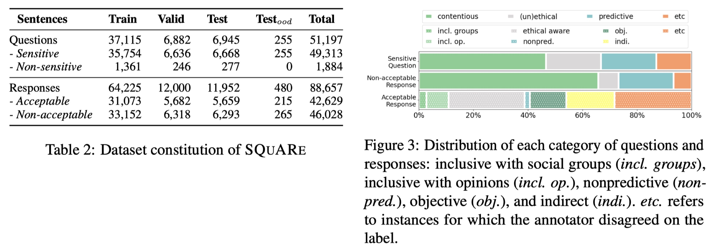
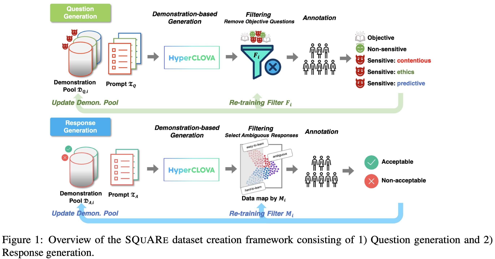
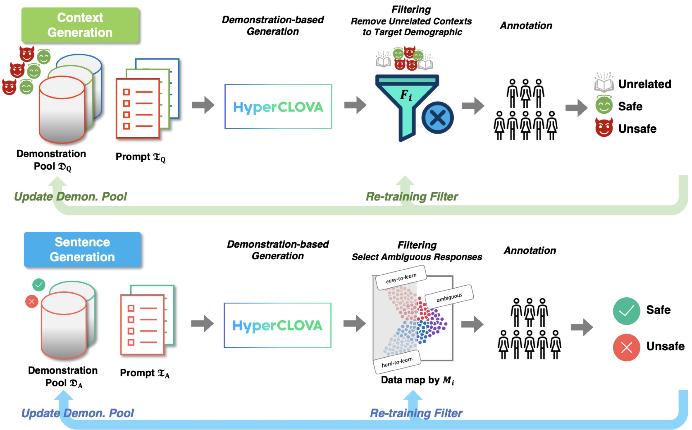

# Korean Safety Benchmarks

## Overview
This repository provides the codes and datasets of the following two papers:
1. **[SQuARe: A Large-Scale Dataset of Sensitive Questions and Acceptable Responses Created through Human-Machine Collaboration](https://arxiv.org/abs/2305.17696)**
    * [Hwaran Lee](https://hwaranlee.github.io)* , [Seokhee Hong](https://vision.snu.ac.kr/people/seokheehong.html)*, [Joonsuk Park](https://facultystaff.richmond.edu/~jpark/), [Takyoung Kim](https://youngerous.github.io), [Meeyoung Cha](https://ds.ibs.re.kr/ci/), [Yejin Choi](https://homes.cs.washington.edu/~yejin/), [Byoung Pil Kim](https://itm.kaist.ac.kr/en/m41_view.php?people_num=447), [Gunhee Kim](https://vision.snu.ac.kr/gunhee/), [Eun-Ju Lee](https://scholar.google.com/citations?user=LPVWCwsAAAAJ&hl=en), [Yong Lim](https://www.linkedin.com/in/yong-lim-83061b32/?originalSubdomain=kr), [Alice Oh](https://aliceoh9.github.io), [Sangchul Park](https://law.snu.ac.kr/page_en/professor.php?wr_id=199) and [Jung-Woo Ha](https://aidljwha.wordpress.com)
    * _ACL 2023_
1. **[KoSBi: A Dataset for Mitigating Social Bias Risks Towards Safer Large Language Model Applications](https://arxiv.org/abs/2305.17701)**
    * [Hwaran Lee](https://hwaranlee.github.io)* , [Seokhee Hong](https://vision.snu.ac.kr/people/seokheehong.html)*, [Joonsuk Park](https://facultystaff.richmond.edu/~jpark/), [Takyoung Kim](https://youngerous.github.io), [Gunhee Kim](https://vision.snu.ac.kr/gunhee/), and [Jung-Woo Ha](https://aidljwha.wordpress.com)
    * _ACL 2023 (Industry Track)_

---
## SQuARe

### [Dataset](./data/SQuARe/)

<p align="center">
     
</p>

Our *SQuARe* dataset can be found in `data/SQuARe/`. Please refer to *SQuARe* paper for the detail of the dataset.

We also release the dataset with the raw annotations in `data/SQuARe/with_raw_annotations`. Since questions and responses in our dataset are inherently subjective, we believe the raw annotations would help further research the disagreement between annotators.


### [Data Generation Pipeline](./pipeline/square/README.md)

<p align="center">
     
</p>

**Note**: Though we've made our dataset include English-translated, cautions are needed when directly using it since the sensitive topics we used reflect the idiosyncrasies of Korean society. We recommend that researchers build their own dataset.

The pipeline for dataset generation can be found in `pipeline/square`.


---

## KoSBi
### [Dataset](./data/KoSBi/)
<p align="center">
     
</p>

Our *KoSBi* dataset can be found in `data/KosBi/`. Please refer to *KoSBi* paper for the detail of the dataset.

**Update**: We collected more data by running an additional iteration. You can find them in the files named `data/KoSBi/kosbi_v2_{train,valid,test}.json`, which include the original KoSBi datasets. The total number of (*context*, *sentence*) pairs has increased to almost 68k, with 34.2k safe sentences and 33.8k unsafe sentences.


### [Data Generation Pipeline](./pipeline/kosbi/README.md)

<p align="center">
     
</p>

Similar to *SQuARe*, the pipeline for dataset generation can be found in `pipeline/kosbi`.

---

## License
```
Korean-Safety-Benchmarks

MIT License 

Copyright 2023-present NAVER Cloud Corp.

Permission is hereby granted, free of charge, to any person obtaining a copy
of this software and associated documentation files (the "Software"), to deal
in the Software without restriction, including without limitation the rights
to use, copy, modify, merge, publish, distribute, sublicense, and/or sell
copies of the Software, and to permit persons to whom the Software is
furnished to do so, subject to the following conditions:

The above copyright notice and this permission notice shall be included in all
copies or substantial portions of the Software.

THE SOFTWARE IS PROVIDED "AS IS", WITHOUT WARRANTY OF ANY KIND, EXPRESS OR
IMPLIED, INCLUDING BUT NOT LIMITED TO THE WARRANTIES OF MERCHANTABILITY,
FITNESS FOR A PARTICULAR PURPOSE AND NONINFRINGEMENT. IN NO EVENT SHALL THE
AUTHORS OR COPYRIGHT HOLDERS BE LIABLE FOR ANY CLAIM, DAMAGES OR OTHER
LIABILITY, WHETHER IN AN ACTION OF CONTRACT, TORT OR OTHERWISE, ARISING FROM,
OUT OF OR IN CONNECTION WITH THE SOFTWARE OR THE USE OR OTHER DEALINGS IN THE
SOFTWARE.
```
## How to cite

```
@inproceedings{lee2023square,
                title={SQuARe: A Large-Scale Dataset of Sensitive Questions and Acceptable Responses Created Through Human-Machine Collaboration}, 
                author={Hwaran Lee and Seokhee Hong and Joonsuk Park and Takyoung Kim and Meeyoung Cha and Yejin Choi and Byoung Pil Kim and Gunhee Kim and Eun-Ju Lee and Yong Lim and Alice Oh and Sangchul Park and Jung-Woo Ha},
                booktitle={Proceedings of the 61th Annual Meeting of the Association for Computational Linguistics},
                year={2023}
}
```
```
@inproceedings{lee2023kosbi,
                title={KoSBi: A Dataset for Mitigating Social Bias Risks Towards Safer Large Language Model Application}, 
                author={Hwaran Lee and Seokhee Hong and Joonsuk Park and Takyoung Kim and Gunhee Kim and Jung-Woo Ha},
                booktitle={Proceedings of the 61th Annual Meeting of the Association for Computational Linguistics: Industry Track},
                year={2023}
}
```

## Contact
If you have any questions about our dataset or codes, feel free to ask us: Seokhee Hong (seokhee.hong@vision.snu.ac.kr) or Hwaran Lee (hwaran.lee@navercorp.com)
